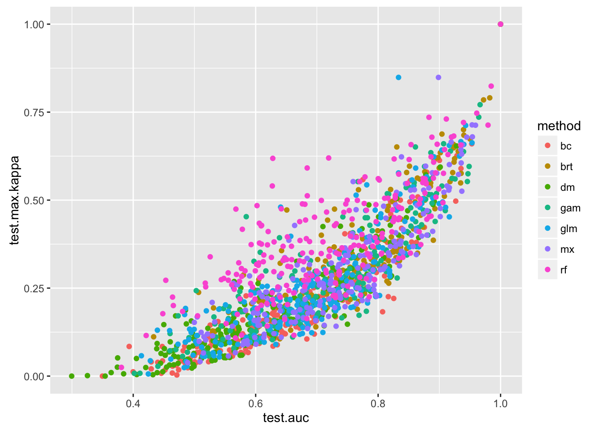

Back to our maxent model for monticola...
```{r}
library(ENMTools)
library(dplyr)
library(ggplot2)
data("iberolacerta.clade")
data("euro.worldclim")

monticola <- iberolacerta.clade$species$monticola
monticola.mx <- enmtools.maxent(monticola, euro.worldclim,
                                test.prop = 0.3)
interactive.plot.enmtools.model(monticola.mx)
```


# Model evaluation in ENMTools

If you look into the model object, you will find "training.evaluation" and "test.evaluation".  These are dismo evaluation objects containing a lot of information about your model.

```{r geog-eval, warning = FALSE}
monticola.mx$training.evaluation

monticola.mx$test.evaluation
```

By default the summary gives you the AUC, correlation, and the threshold value that maximizes the sum of true positive and true negative predictions.  However, there's a lot more information in these objects than that.  You can find those by going to the help page for the evaluate function in dismo.  To access these elements you'll need to use the @ symbol, because ModelEvaluation objects S4 objects.  You can also use the plotting functions from dismo to visualize these metrics.


```{r eval-help}
help(evaluate)

monticola.mx$training.evaluation@kappa

plot(monticola.mx$test.evaluation, 'ROC')

plot(monticola.mx$test.evaluation, 'kappa')

boxplot(monticola.mx$test.evaluation)

density(monticola.mx$test.evaluation)
```


There's been a lot of back-and-forth about these various metrics (e.g. here: http://onlinelibrary.wiley.com/doi/10.1111/j.1365-2664.2006.01214.x/full), but they're pretty much all different flavors of "how well does your model tell presence data from absence or background data".  I'm not entirely convinced that the argument is all that important, though, given results like these from thousands of simulations:




You'll notice that kappa is the least correlated with the other two, which is likely due to variation in prevalence across studies.  It's still pretty highly correlated, though.  In summary: although there may be differences between these metrics that are important on some sort of absolute scale, they are unlikely to give you radically different answers when choosing between alternative models built using the same data.  I'll talk more about how we might make better use of these metrics in a little while.


In addition to the traditional methods of measuring model fit for ENM/SDM studies, ENMTools implements a new way of thinking about model fit.  If we think of models as estimates of the species' responses to a set of environmental predictors instead of as a formula to generate a map, we might want to evaluate how well our model fits our data in environment space, not just in geographic space.  This presents some difficulties, however; environment spaces can have an arbitrary number of dimensions, have no set boundaries, and have both continuous and discrete axes.  

However, we can get an approximation of the fit of our model in environment space by Latin hypercube sampling of the space of possible environmental combinations.  ENMTools does this automatically when you build a model, evaluating the ability of your model to distinguish presence and absence (or pseudoabsence) points within the environment space defined by the minima and maxima of your predictors in the environmental layers you pass to it.

Compare the fit of some of the models above in environment space to their fit in geographic space.

```{r env-auc}
monticola.gam <- enmtools.gam(species = monticola, env = euro.worldclim, f = pres ~ bio3 + bio8 + bio11, test.prop = 0.3, nback = 400)

monticola.gam$test.evaluation
monticola.gam$env.test.evaluation
```

# Spatially structured model evaluation

Let's look again at our model's training and test data.

```{r block-test1}
plot(monticola.gam)
```
Notice how the geographic range of the training and test data is quite similar?  Because of that similarity, and because the environment is spatially autocorrelated, our training and test data will often tend to be quite similar in the set of environments they encompass.  This creates a situation where it's often relatively easy for a model to achieve good performance on randomly withheld test data.  In contrast, if we're using our models to predict to different times and spaces, the projections we make can be made into quite different areas of environment space.  When this is the case, the performance of our model on randomly withheld test data may be a poor indicator of how well it might extrapolate to new conditions.

For this reason, some investigators have proposed that we instead evaluate our models on spatially structured subsets of our data.  We are currently incorporating this feature into ENMTools; it is working now, but we plan to expand on this functionality signficiantly.  At present we use the block partitioning functionality of ENMeval.  This procedure partitions the data into four blocks by splitting the data in half horizontally and vertically, and then holds out the data from one of those blocks for testing purposes.  We can do this with our ENMTools models just by passing "block" to the test.prop argument.

```{r block-test2}
monticola.gam <- enmtools.gam(species = monticola, env = euro.worldclim, f = pres ~ bio3 + bio8 + bio11, test.prop = "block", nback = 400)
monticola.gam
monticola.gam$response.plots

visualize.enm(monticola.gam, euro.worldclim, layers = c("bio11", "bio8"), plot.test.data = TRUE)
```


# Calibration

One alternative to discrimination metrics is to measure calibration.  Rather than simply asking how well an idealized threshold applied to your model separates your data into presence and background points, calibration metrics measure how accurately your suitability scores estimate the true frequency of presences vs. background or absence points in a given set of grid cells.  

Measuring calibration using ENMTools is simple; ENMTools model objects are set up to talk to the **CalibratR** package already.

```{r}
monticola.gam <- enmtools.gam(species = monticola, env = euro.worldclim, f = pres ~ bio3 + bio8 + bio11, test.prop = 0.3, nback = 400)


mont.cal <- enmtools.calibrate(monticola.gam)

mont.cal
```

The plot in the top left measures how correlated your predicted and observed probability of presence are, while the histograms show the distribution of suitability values at presence and absence or background sites.  The metrics in the table in the lower left are various measures of calibration.  The expected calibration error and maximum calibration error are essentially measures of how often one will make mistakes in predicting presence of the species either across all suitability bins (ECE) or in the bin with the maximum error rate (MCE).  These metrics assume that the ration of presence to background points in your test data matches the true prevalence of the species across the projected study area, and if you don't know that's the case it's probably not worth interpreting these scores too rigorously.

The continuous Boyce index is simply a Spearman rank correlation coefficient measuring the correlation between predicted and observed probabilities of presence.  It is not sensitive to prevalence, and as such is probably the most useful metric for most cases.

In addition to measuring model calibration we can REcalibrate models.  This is essentially a matter of fitting a post hoc model to our SDM that modifies its suitability scores to better estimate the frequency of observations in the test data.  Again it's worth noting that these methods assume that the presence/background ratio in your test data is similar to the prevalence of your species in the real world, so if you don't know that's the case these recalibrations should be taken with a grain of salt.  Phillips and Elith came up with a method for readjusting these recalibrations for prevalence, but these are not currently implemented in ENMTools.

Be aware that the following code will take a few minutes; some of these methods are quite cpu-heavy.  There's also currently an issue with the **parallel** package that's causing the **CalibratR** package to fail recalibration unless you paste some nonsense in here, so that's what the first bit is here.  
```{r}
## WORKAROUND: https://github.com/rstudio/rstudio/issues/6692
## Revert to 'sequential' setup of PSOCK cluster in RStudio Console on macOS and R 4.0.0
if (Sys.getenv("RSTUDIO") == "1" && !nzchar(Sys.getenv("RSTUDIO_TERM")) && 
    Sys.info()["sysname"] == "Darwin" && getRversion() >= "4.0.0") {
  parallel:::setDefaultClusterOptions(setup_strategy = "sequential")
}

mont.cal <- enmtools.calibrate(monticola.gam, recalibrate = TRUE)

mont.cal
```

We now have our model recalibrated a bunch of different ways!  Let's see what those maps look like.  Fair warning: CalibratR returns a LOT of information, so these objects can be challenging to navigate.  You may notice a disconnect between the apparent correlation in the plot in the top left and the Boyce index values in the table.  The Boyce index is actually being calculated over different data; it's calculated using 100 bins for the x axis and the predicted/expected ratio for the y axis.  As such it tends to be unhappy about models for which a lot of those suitability "bins" are empty.  We're still working on better ways of presenting these different approaches.

We used the recalibrated models to make suitability rasters, though, which you can find under mont.cal$calibrated.suitabilities.

```{r}
plot(mont.cal$calibrated.suitabilities$BBQ_scaled_avg)
points(monticola$presence.points, pch = 16)
```


# Statistical significance of ENM predictions

Spatial autocorrelation makes it somewhat difficult to know how to actually assess these metrics for ENMs.  Many of the null expectations we have for uninformative models don't include various aspects of our data or predictors, and as such could tend to underestimate the expected performance of an uninformative model.

## Bahn and McGill test

Bahn and McGill suggested that, since environmental variables are spatially autocorrelated, the performance of a model should be compared to the performance of a model built using the same points on spatial predictors that are spatially autocorrelated but not biologically relevant.  They created a set of fake predictors for "eastness" and "northness", and measured how well models fit occurrence points using these predictors.

```{r}
lat <- lon <- euro.worldclim[[1]]
xy <- coordinates(euro.worldclim[[1]])
lon[] <- xy[, 1]
lat[] <- xy[, 2]

fake.env <- stack(c(lon, lat))
names(fake.env) <- c("fakelon", "fakelat")
plot(fake.env)
fake.env <- mask(fake.env, euro.worldclim[[1]])
fake.env <- setMinMax(fake.env)
plot(fake.env)

fake.gam <- enmtools.gam(monticola, fake.env, test.prop = 0.3)
fake.gam
```

What do you think about the results when compared with your empirical GAM?  What are your thoughts on the null hypothesis this model represents?


## Monte Carlo tests of model fit

The Bahn and McGill test sets a baseline expected performance based on a specific model of spatial autocorrelation, but our empirical predictors may have different levels of autocorrelation as well as multicollinearity.  How can we incorporate our empirical modeling conditions into our null expectation?  In other words, how well CAN a model be expected to fit the data, given the local level of environmental heterogeneity and collinearity, and the spatial autocorrelation present in the occurrence data?  

Even if we can factor these in to get the expected performance of an uninformative model, the average behaviour for an uninformative model is only one part of the answer.  Without error bars around that expectation, we have no idea whether a particular model is reliable or not.  For that reason, Raes and ter Steege came up with a Monte Carlo randomization test based on generating replicate models using uninformative point data.  This method keeps the predictors and study region from our empirical model, but generates models using uninformative locality data.

Let's build a single uninformative model so we can see what that looks like.

```{r uninformative-model}
fake.species <- monticola

# We're just going to sample some random points from the background and call them presence points
fake.species$presence.points <- as.data.frame(randomPoints(fake.species$range, nrow(fake.species$presence.points)))

fake.gam <- enmtools.gam(species = fake.species, env = euro.worldclim, f = pres ~ bio3 + bio8, test.prop = 0.3, nback = 400)

plot(fake.gam)

visualize.enm(fake.gam, euro.worldclim, layers = c("bio3", "bio8"))
```

Notice how there is spatial and environmental structure to our model even though the data itself carries no biological information?  This is the behaviour that the Raes and ter Steege tests are intended to correct for.

These tests are now implemented in the ENMTools modeling functions, and are accessed using the "rts.reps" argument.

```{r rts, warning=FALSE, message = FALSE}
monticola.gam <- enmtools.gam(species = monticola, env = euro.worldclim, f = pres ~ bio3 + bio8, test.prop = 0.3, nback = 400, rts.reps = 100)

monticola.gam$rts.test$rts.pvalues

monticola.gam$rts.test$rts.plots

monticola.glm <- enmtools.glm(species = monticola, env = euro.worldclim, f = pres ~ poly(bio3, 4) + poly(bio8, 4), test.prop = 0.3, nback = 400, rts.reps = 100)

monticola.glm$rts.test$rts.pvalues

monticola.glm$rts.test$rts.plots

visualize.enm(monticola.glm, euro.worldclim, layers = c("bio1", "bio8"), plot.test.data = TRUE)

plot(monticola.glm)
```

It's worth noting that the Raes and ter Steege method was initially proposed to measure significance of fit on training data only - all of the data would be used for fitting the model, and the fit of the model to that data would be evaluated using the Monte Carlo test.  ENMTools' implementation allows you to also evaluate model fit to test data by randomly resampling training and test data from the training region for each replicate.  If you want to do the "classic" test as R&tS proposed, just set test.prop to zero.

More recently Bohl et al. presented a method that modifies these by keeping the test data from the empirical data set and just randomly resampling training data.  This test isn't implemented in ENMTools yet, but we can fake it!  The models for our rts reps with test.prop = 0.3 are exactly what we need, we just need to evaluate their fit to the empirical test data.

You'll find the models from the replicates stashed deep in the monticola.gam object.  For rep 1, for instance, the model is at **monticola.gam$rts.test$rts.models$rep.1$model**.  To evaluate the fit of that model to our empirical test points you could just do this:

```{r}
test.pres <- monticola.gam$test.data
test.bg <- monticola.gam$analysis.df %>%
  filter(presence == 0) %>%
  select(Longitude, Latitude)

dismo::evaluate(test.pres, test.bg,
                monticola.gam$rts.test$rts.models$rep.1$model,
                euro.worldclim)
```

Okay, so can we do that to all of the rts.rep models at once?

```{r}
test.pres <- monticola.gam$test.data
test.bg <- monticola.gam$analysis.df %>%
  filter(presence == 0) %>%
  select(Longitude, Latitude)


bohl.test <- function(thismodel){
  dismo::evaluate(test.pres, test.bg, thismodel, euro.worldclim)
}


null.dist <-sapply(monticola.gam$rts.test$rts.models, 
       FUN = function(x) bohl.test(x$model)@auc)
null.dist <- c(monticola.gam$test.evaluation@auc, null.dist)
names(null.dist)[1] <- "empirical"

qplot(null.dist, geom = "histogram", fill = "density", alpha = 0.5) +
        geom_vline(xintercept = null.dist["empirical"], linetype = "longdash") +
        xlim(0,1) + guides(fill = FALSE, alpha = FALSE) + xlab("AUC") +
        ggtitle(paste("Model performance in geographic space on test data")) +
        theme(plot.title = element_text(hjust = 0.5))
```


So there are three different Monte Carlo tests to evaluate model performance against a null distribution.  Can you say in words what each of those null distributions means?  Or to put it another way, what are the conditions under which a model is expected to outperform each null distribution?  Think about what a model would have to predict better than expected for each.


## Warren et al. (in review) test for model bias

Okay, remember how we projected a model we had to a future climate scenario?

```{r warning=FALSE}
spain.future <- raster::getData('CMIP5', var = "bio", res = 10, rcp = 85, model = 'AC', year = 70)

spain.future <- crop(x = spain.future, y = euro.worldclim)
names(spain.future) <- names(euro.worldclim)

future.pred <- predict(monticola.gam, spain.future)
future.pred$suitability
```

Real quick let's just measure the average change in habitat suitability predicted between the present and future climate scenario.

```{r warning=FALSE}
change.raster <- future.pred$raster - monticola.gam$suitability

plot(change.raster)
```

So mostly it looks like habitat quality is predicted to decline in the places where the species lives right now.  Let's just get the average change in habitat suitability.

```{r warning=FALSE}
mean.change <- mean(getValues(change.raster), na.rm = TRUE)

mean.change
```
So on average there's a decline in suitability scores of 0.1 predicted over the next 50 years.  Is it possible that some of that is due to biases, though?  For instance, if there were a ton of habitat in the future that represent climates for which there is no current analog, would that induce some bias in the changes we predict?  Are there also biases produced by our choice of algorithm, given that some tend to extrapolate quite a bit and others not at all?

It turns out we can do something very similar to our Monte Carlo tests for model fit and use it to get estimates of the bias built into a given ENM/SDM study design.  Basically we just take our empirical study design (algorithm, study area, and future climate scenario) and run randomly selected data points from the study area through it.  Then we measure the same summary statistics on those uninformative models as we do on our real models (e.g., average suitability change above) and compare our empirical results to our null distribution!  

Again this isn't currently implemented as a test in ENMTools (the paper is still in review), but you can hand-roll it fairly easily.  If we want to look at the gam, we can even just reuse our rts reps!

```{r warning=FALSE}
bias.test <- function(thismodel){
  this.change <- predict(spain.future, thismodel, type = "response") - monticola.gam$suitability
  this.mean.change <- mean(getValues(this.change), na.rm = TRUE)
  return(this.mean.change)
}


null.dist <-sapply(monticola.gam$rts.test$rts.models, 
       FUN = function(x) bias.test(x$model))
null.dist <- c(mean.change, null.dist)
names(null.dist)[1] <- "empirical"

qplot(null.dist, geom = "histogram", fill = "density", alpha = 0.5) +
        geom_vline(xintercept = null.dist["empirical"], linetype = "longdash") + 
  guides(fill = FALSE, alpha = FALSE) + xlab("Mean change") +
        ggtitle(paste("Change in average suitability of habitat")) +
        theme(plot.title = element_text(hjust = 0.5))

```

We find that our empirical model predicts much more of a decline in suitability than expected if our occurrence data were random.  This strongly suggests that, whatever the reason the suitability is expected to decline, it is *not* simply a methodological artifact.

